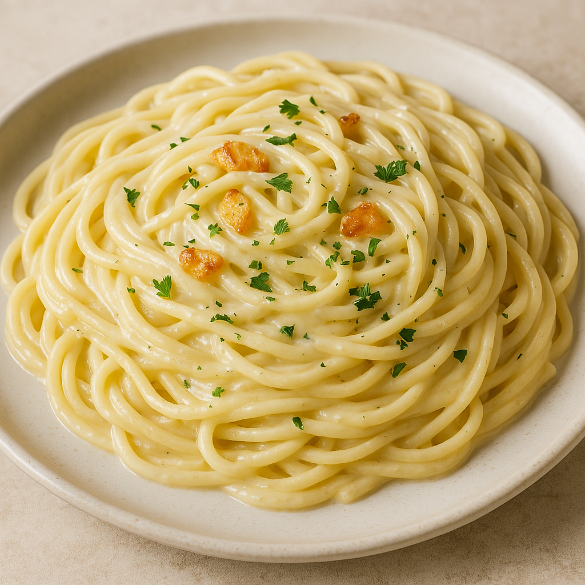

# 🍝 Recipe Card Project

A clean and minimal **Recipe Card** built using **HTML & CSS**.  
This project displays a beautiful recipe layout with ingredients, instructions, and an image — perfect for practicing card UI design and responsive layout basics.

---

## 🌟 Features

- 📱 Fully responsive and centered layout  
- 🎨 Soft background with a card shadow effect  
- ✨ Smooth hover animation  
- 🧑‍🍳 Structured design: Image, Ingredients, and Instructions  
- 💡 Beginner-friendly HTML & CSS code — easy to understand and modify

---

## 🧠 What I Learned

- How to structure content using semantic HTML  
- Styling cards using box-shadow and border-radius  
- Creating smooth hover transitions  
- Building clean UI layouts with spacing and alignment  

---

## 🛠️ Built With

- **HTML5**
- **CSS3**
- Fonts: *Poppins (optional)*
- Icons/Images: *Free image from open sources*

---

## 🖼️ Project Preview



---

## 🚀 How to Use

1. Clone this repository:
   ```bash
   git clone https://github.com/<your-username>/recipe-card-project.git
